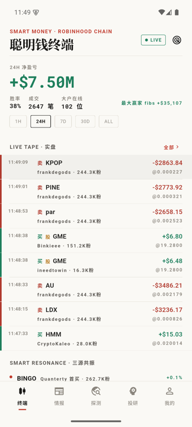
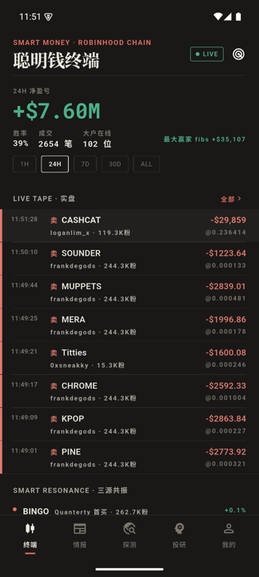
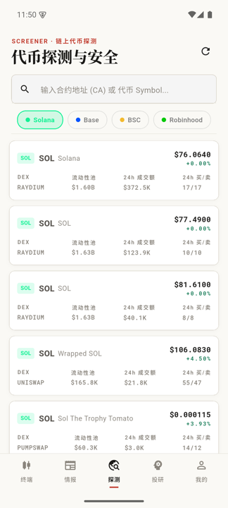
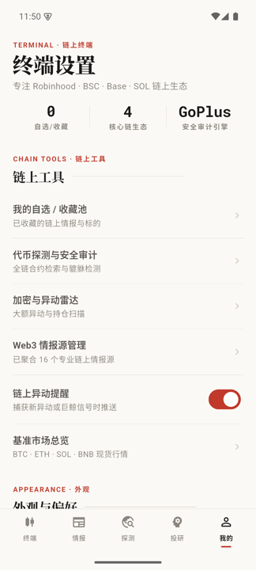

<div align="center">

# InfoFlow Terminal

**生产级链上区块链信息与情报获取平台**

专注于 **Robinhood Chain · BSC · Base · Solana** 四大链生态：聪明钱实盘 Tape、三源共振、
代币探测与 GoPlus 安全审计、实时快讯流、破圈信号雷达，以及全天候链上异动主动触达。


</div>

## 📱 应用一览

| 聪明钱终端（浅色） | 聪明钱终端（深色） | 情报热榜 · 实时快讯 |
| :---: | :---: | :---: |
|  |  |  |

| 链上情报流 | 代币探测与安全 | 投研大脑 | 终端设置 |
| :---: | :---: | :---: | :---: |
|  |  |  |  |

> 设计系统：「纸上终端」——纸感底色、墨色文字、发丝线分隔、衬线标题 + 等宽数字、
> 编辑红为唯一强调色（紫色只留给雷达信号）。浅色「纸」/ 深色「墨」双主题。
> 高保真交互原型见 [design-v2.html](./design-v2.html)（浏览器直接打开）。

## ✨ 核心特性

### 🕯 聪明钱终端（首页）

- **LIVE TAPE 实盘**：被追踪的 108 个 fomo.family 钱包的每一笔链上买卖，
  WebSocket 推送、断线自动降级 2.5s 轮询、回前台增量补拉，数据不丢；
  股票 track（NVDA/COIN 等）与代币成交混排，支持「全部 / 币 / 股」分流
- **多时间窗总览**：24H 净盈亏主数字支持 `1H / 24H / 7D / 30D / ALL` 五档切换
- **三源共振**：新币启动 × 巨鲸首买 × 流动性激增 同时命中即提示，附共振评分
- **抱团跟单链**：领买人 → 跟随者（含滞后秒数），谁在跟随谁一目了然
- **大户榜**：胜率 / 仓位状态（加仓 / 出货 / 空仓）/ 实现与浮动盈亏；
  六维排序（总盈亏 / 浮动 / 胜率 / 成交额 / 笔数 / 粉丝数）；24H 为
  robinhoodtrenches 榜，7D/30D/全部自动切换 fomo 全链跨链榜
- **庄家雷达**：费率极端追多、低市值 + OI 异常埋伏、24H 热度榜

### 📰 链上情报（Signal Hub 信号中枢）

- **推荐 / 关注 / 热榜** 三栏情报流，内置 16 个专业源
  （Blockworks、Decrypt、CoinDesk、Foresight News、PANews、各公链官方博客、
  SoPilot X 起爆帖等），支持 OPML 导入导出与自定义 RSS
- **热榜 = 实时快讯流**：聚合财联社、华尔街见闻、金十数据、FastBull 四源快讯，
  分钟级新鲜度
- **情报即信号**：每条情报自动经本地 ticker 词典标注涉及标的
  （`$SOL` `$BNB` `$AERO`…），徽章直通代币探测与安全审计
- **AI 摘要**：卡片级内容提炼，配置 LLM API key 后升级为投研级摘要

### 📡 破圈雷达

- 监控微博 / 知乎 / 头条大众热榜，标题命中 Web3 关键词（行业词 + 主流币
  中文别名词典，拉丁短别名词边界防误报）即视为**出圈前兆信号**
- 终端首页展示命中条目；后台每 10 分钟扫描，新增命中经系统通知主动推送
  （指纹去重，同一话题反复上榜不打扰）

### 🔍 代币探测（Screener）

- 输入合约地址（CA）或 Symbol，跨四链检索；热门池一键浏览
- **GoPlus 深度安全体检**：貔貅检测、买卖税率、LP 状态、合约权限、
  Top 10 持仓占比，评分条直读；高危合约红色警示
- 一键复制 CA、Blockscout / DexScreener 浏览器直达

### 🤖 投研大脑（Copilot）

- 结合 DexScreener 实时行情与 GoPlus 审计数据的本地规则引擎问答
- 快捷指令：今日链上 Alpha、合约风险诊断、巨鲸动向速览、生态周报
- 配置 LLM API key 后解锁完整投研问答

### 👤 终端设置

- 主题模式（跟随 / 浅色 / 深色）、自选池跨链监控、异动提醒阈值
- 强信号推送总开关（聪明钱异动 / 破圈信号共用）、GoPlus 与行情源连接状态

### 🔔 后台主动触达

- **聪明钱异动**：关注的大户成交 ≥ $500，或粉丝 ≥ 20 万的 KOL 首买 ≥ $1000
- **破圈信号**：大众热榜新命中 Web3 关键词
- 全部经指纹去重（上限 300 条保留最新），受推送总开关统一约束

## 🛠 数据管道

| 数据源 | 用途 | 接入方式 |
| --- | --- | --- |
| [robinhoodtrenches.com](https://robinhoodtrenches.com) | 聪明钱实盘 / 榜单 / 共振 / 跟单链 / 雷达 | REST ×9 + WebSocket `/ws`（只读、无鉴权） |
| [fomo.family](https://fomo.family) | 7D/30D/全部 跨链大户榜、交易员档案 | REST |
| [DexScreener](https://dexscreener.com) | 多链 DEX 池子、流动性、报价 | REST |
| [GoPlus Security](https://gopluslabs.io) | 合约安全审计（貔貅 / 税率 / 权限） | REST |
| [Binance](https://binance.com) | 主流现货与合约深度报价 | REST |
| [NewsNow](https://github.com/ourongxing/newsnow) | 中文财经实时快讯 + 大众热榜（破圈监测） | REST（公共实例，可自建） |
| [SoPilot](https://sopilot.net/zh/hot-tweets) | X（Twitter）Web3 起爆帖监控 | RSS |
| Web3 RSS | 各公链官方博客与行业媒体 | RSS / OPML |

## 📁 工程结构

```
lib/
├── main.dart                      # 应用入口（初始化通知 + 后台告警轮询）
├── app/
│   ├── router.dart                # 五大核心分支路由与深链
│   └── theme.dart                 # 「纸上终端」设计系统（纸感/墨色/发丝线/语义色）
├── core/
│   ├── network/                   # Dio 封装与异常映射
│   ├── notifications/             # 本地通知服务 + 指纹去重
│   ├── state/                     # 全局共享状态（订阅/自选池/阅读统计/关注大户）
│   └── storage/                   # SharedPreferences KV 存储
├── shared/widgets/                # 发丝线/ Magazine 卡片/ 按压缩放/ 骨架屏等通用件
└── features/
    ├── smart_money/               # 聪明钱终端（tape 流/共振/跟单链/榜单/告警）
    │   ├── data/                  #   rht_api ×9 端点、WS 韧性流、fomo_api、告警
    │   └── presentation/          #   首页 teaser + 完整终端五分段
    ├── feed/                      # 链上情报流（RSS + NewsNow 快讯 + SoPilot 起爆帖）
    │   └── data/                  #   rss_sources ×16、newsnow_repository、破圈告警
    ├── signal_hub/                # ticker 词典与情报徽章中枢（Pulse）
    ├── token_screener/            # 代币探测器与 GoPlus 安全审计
    ├── crypto_radar/              # 庄家雷达（费率/OI/热度扫描）
    ├── market/                    # 基准行情总览与币种详情
    ├── ai_chat/                   # 投研大脑（本地规则引擎，可接 LLM）
    ├── subscription/              # 订阅源管理与 OPML
    ├── reader/                    # 阅读器（含首字下沉排版）
    ├── bookmark/ search/ profile/ # 收藏 / 全文检索 / 终端设置
    └── ...
```

## 🚀 快速开始

### 运行环境

- Flutter SDK ≥ 3.12 / Dart SDK ≥ 3.12
- Android 模拟器或真机（iOS 需完整 Xcode + CocoaPods）

### 安装与运行

```bash
# 1. 安装依赖
flutter pub get

# 2. 生成代码（Riverpod / KV 存储 codegen）
dart run build_runner build --delete-conflicting-outputs

# 3. 运行测试（107 项）
flutter test

# 4. 启动应用
flutter run
```

### 构建 APK

```bash
flutter build apk --release            # 通用包
flutter build apk --split-per-abi      # 分 ABI 小包
```

### Android 模拟器（可选）

```bash
# 已有 AVD 时直接启动
emulator -avd <avd_name> &
flutter run -d emulator-5554
```

## 📄 开源协议

本项目基于 [MIT License](./LICENSE) 开源。

> ⚠️ 本应用仅聚合公开链上数据与公开资讯，不构成任何投资建议。
